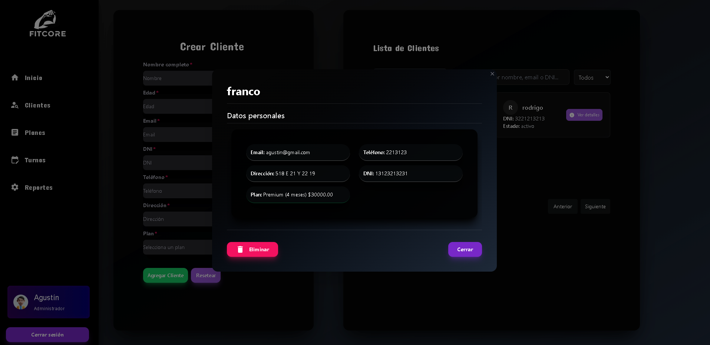
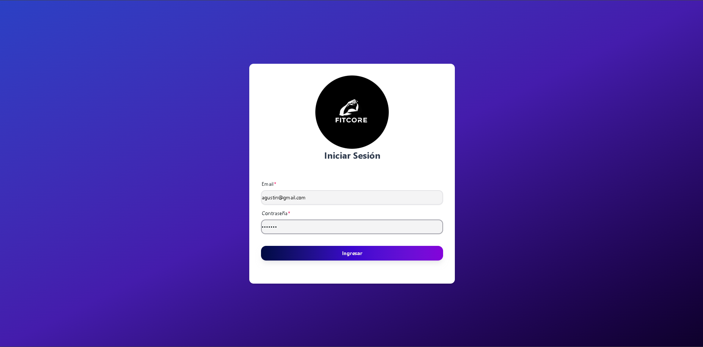
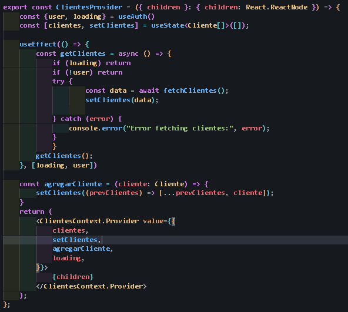
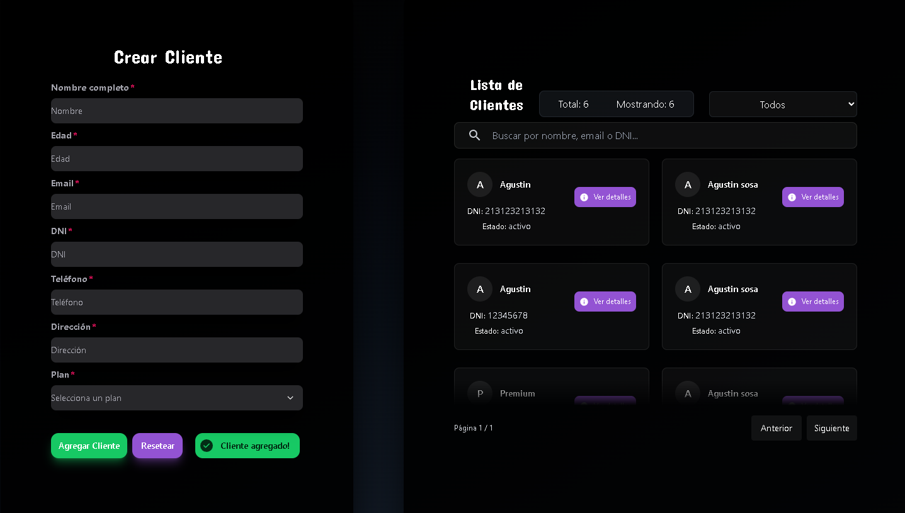
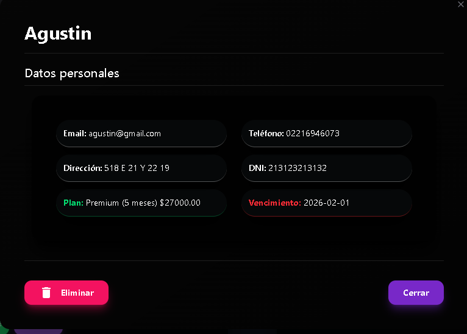
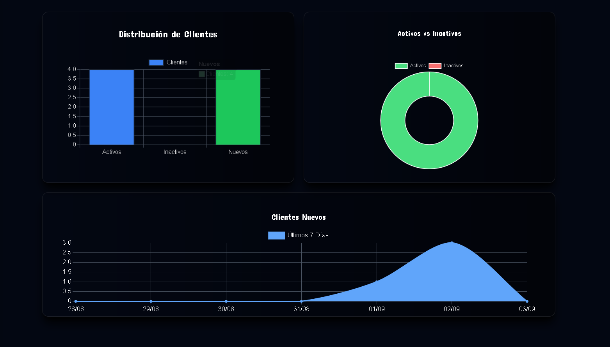
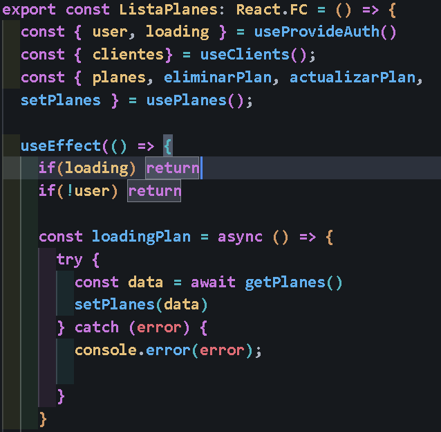

# FitCore

Plataforma SaaS para entrenadores y gimnasios, que permite gestionar clientes y planes de manera eficiente.

---

## Descripción

Es una plataforma que permite gestionar clientes y planes de gimnasios y/o entrenadores, centralizando la información y facilitando la administración diaria.

---

## Capturas de pantalla

<h3 align="center">Sección principal de la página.</h3>

  

<h3 align="center">Formulario de login.</h3>

  

<h3 align="center">Login mediante un provider, usando fetch a una URL en variables de entorno. Se manejan errores y se actualiza el estado del usuario si la respuesta es satisfactoria.</h3>

  

<h3 align="center">Interfaz para la creación de clientes. Se pueden filtrar por estado (activo/inactivo) y por número de DNI.</h3>

  

<h3 align="center">Vista detallada de los datos de un cliente.</h3>

  

<h3 align="center">Datos mostrados a través de ChartsJS.</h3>

  

<h3 align="center">Ejemplo de destructuring de datos para acceder a clientes y planes desde otro componente, manteniendo la persistencia del estado.**</h3>

  

---

## Tecnologías utilizadas

**Cliente:** React, Context API, TailwindCSS, HERO UI  
**Servidor:** NodeJS, Express, PostgreSQL

---

## Funcionalidades destacadas

- Los planes agregados solo se pueden eliminar si no hay clientes activos asociados, evitando errores por eliminación accidental.  
- Es una SPA (Single Page Application) que permite navegar rápidamente entre rutas usando React Router.  
- La persistencia de datos se mantiene centralizando el estado de clientes y planes.

---

## Futuras mejoras
- Reportes avanzados.  

---

## Autor

- [@agustinsosa79](https://www.github.com/agustinsosa79)
